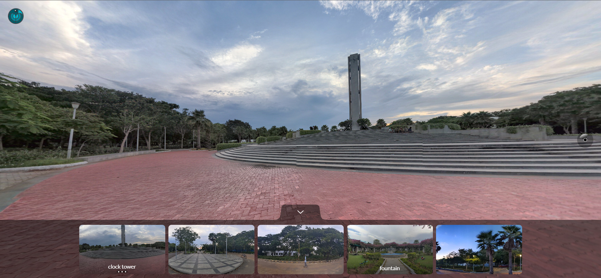
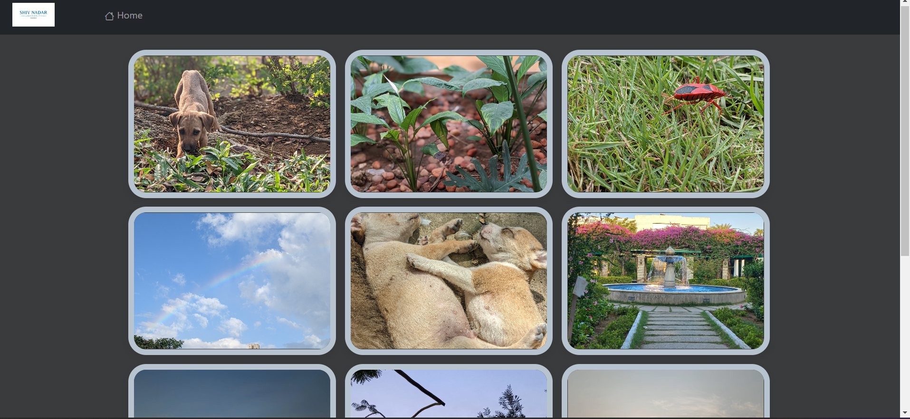
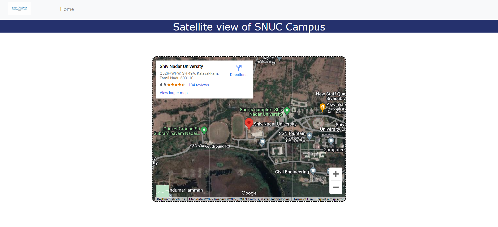

# SNUCTour 3D Web Application

In this project we have created a site for SNUC in order to be able to give a tour of the campus

This is built on the problem statement that not everyone can come for a campus tour
especially if they are very far away from that campus.

This web application solves that by giving a virtual tour and a satellite view of the campus:

## 1) Created a main webpage for the site

## 2) Made a tour via panoraven to tour with the 3D images

## 3) There is a gallery view for looking at the scenic beauty of the campus

## 4) There is also a satellite view linked to the google maps in order to give directions to the campus or for people to see the satellite view of the campus

## Precautions

Please download all the image and css and html files in order to run the web application and put all the following in a single file
